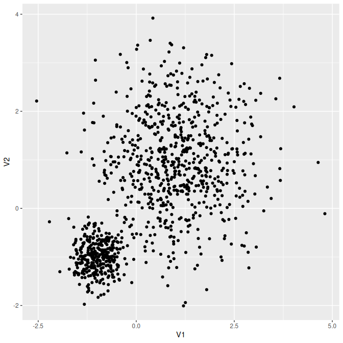

<!-- README.md is generated from README.Rmd. Please edit that file -->

# Utilities for developing R code <a href="https://loelschlaeger.de/oeli/"></a>

<!-- badges: start -->

[](https://CRAN.R-project.org/package=oeli)
[](https://CRAN.R-project.org/package=oeli)
[](https://github.com/loelschlaeger/oeli/actions/workflows/R-CMD-check.yaml)
[](https://app.codecov.io/gh/loelschlaeger/oeli?branch=master)
<!-- badges: end -->

This [R](https://CRAN.R-project.org) package provides helper functions I
found useful when developing R code - perhaps you will too! The released
package version can be installed via:

``` r
install.packages("oeli")
```

The following shows some demos. Click the headings for references on all
available helpers in each category.

### [Distributions](https://loelschlaeger.de/oeli/reference/index.html#distribution)

The package has density and sampling functions for some distributions
not included in base R, like the Dirichlet:

``` r
ddirichlet(x = c(0.2, 0.3, 0.5), concentration = 1:3)
#> [1] 4.5
rdirichlet(concentration = 1:3)
#> [1] 0.01795087 0.41315984 0.56888929
```

Or the mixture of Gaussian distributions:

``` r
x <- c(0, 0)
mean <- matrix(c(1, 1, -1, -1), ncol = 2) # means in columns
Sigma <- matrix(c(diag(2), 0.1 * diag(2)), ncol = 2) # vectorized covariances in columns
proportions <- c(0.7, 0.3)
dmixnorm(x = x, mean = mean, Sigma = Sigma, proportions = proportions)
#> [1] 0.04100656
pmixnorm(x = x, mean = mean, Sigma = Sigma, proportions = proportions)
#> [1] 0.3171506
rmixnorm(n = 1000, mean = mean, Sigma = Sigma, proportions = proportions) |>
  as.data.frame() |> 
  ggplot2::ggplot() + ggplot2::geom_point(ggplot2::aes(x = V1, y = V2))
```



### [Function helpers](https://loelschlaeger.de/oeli/reference/index.html#functional)

Retrieving default arguments of a `function`:

``` r
f <- function(a, b = 1, c = "", ...) { }
function_defaults(f)
#> $b
#> [1] 1
#> 
#> $c
#> [1] ""
```

### [Indexing helpers](https://loelschlaeger.de/oeli/reference/index.html#indexing)

Create all possible permutations of vector elements:

``` r
permutations(LETTERS[1:3])
#> [[1]]
#> [1] "A" "B" "C"
#> 
#> [[2]]
#> [1] "A" "C" "B"
#> 
#> [[3]]
#> [1] "B" "A" "C"
#> 
#> [[4]]
#> [1] "B" "C" "A"
#> 
#> [[5]]
#> [1] "C" "A" "B"
#> 
#> [[6]]
#> [1] "C" "B" "A"
```

### [Package helpers](https://loelschlaeger.de/oeli/reference/index.html#packaging)

Quickly have a basic logo for your new package:

``` r
logo <- package_logo("my_package", brackets = TRUE)
print(logo)
```


How to print a `matrix` without filling up the entire console?

``` r
x <- matrix(rnorm(10000), ncol = 100, nrow = 100)
print_matrix(x, rowdots = 4, coldots = 4, digits = 2, label = "what a big matrix")
#> what a big matrix : 100 x 100 matrix of doubles 
#>         [,1]  [,2] [,3] ... [,100]
#> [1,]    -0.3 -0.74 -0.1 ...   1.01
#> [2,]    1.39 -2.06 1.29 ...   -0.5
#> [3,]   -0.45 -1.57 0.43 ...   1.61
#> ...      ...   ...  ... ...    ...
#> [100,]  1.12  0.77 -1.6 ...  -0.08
```

And what about a `data.frame`?

``` r
x <- data.frame(x = rnorm(1000), y = LETTERS[1:10])
print_data.frame(x, rows = 7, digits = 0)
#>      x  y
#> 1     0 A
#> 2     1 B
#> 3     0 C
#> 4    -1 D
#> <993 rows hidden>
#>          
#> 998   0 H
#> 999   0 I
#> 1000  2 J
```

### [Simulation helpers](https://loelschlaeger.de/oeli/reference/index.html#simulation)

Let’s simulate correlated regressor values from different marginal
distributions:

``` r
labels <- c("P", "C", "N1", "N2", "U")
n <- 100
marginals <- list(
  "P" = list(type = "poisson", lambda = 2),
  "C" = list(type = "categorical", p = c(0.3, 0.2, 0.5)),
  "N1" = list(type = "normal", mean = -1, sd = 2),
  "U" = list(type = "uniform", min = -2, max = -1)
)
correlation <- matrix(
  c(1, -0.3, -0.1, 0, 0.5,
    -0.3, 1, 0.3, -0.5, -0.7,
    -0.1, 0.3, 1, -0.3, -0.3,
    0, -0.5, -0.3, 1, 0.1,
    0.5, -0.7, -0.3, 0.1, 1),
  nrow = 5, ncol = 5
)
data <- correlated_regressors(
  labels = labels, n = n, marginals = marginals, correlation = correlation
)
head(data)
#>   P C         N1         N2         U
#> 1 0 3  0.3779594 -0.5399528 -1.664235
#> 2 2 1 -1.9097841 -0.1398213 -1.142377
#> 3 0 3 -3.8363473 -0.6662795 -1.493751
#> 4 1 1 -2.2852178  1.0034751 -1.123158
#> 5 4 1 -2.4448249  0.8829295 -1.029190
#> 6 0 3 -0.8822268  1.1187363 -1.954928
cor(data)
#>              P          C          N1          N2          U
#> P   1.00000000 -0.2659247 -0.08918885  0.04813486  0.4908038
#> C  -0.26592466  1.0000000  0.36584848 -0.55348374 -0.7370335
#> N1 -0.08918885  0.3658485  1.00000000 -0.30000000 -0.3248601
#> N2  0.04813486 -0.5534837 -0.30000000  1.00000000  0.1024402
#> U   0.49080378 -0.7370335 -0.32486014  0.10244024  1.0000000
```

### [Transformation helpers](https://loelschlaeger.de/oeli/reference/index.html#transformation)

The `group_data.frame()` function groups a given `data.frame` based on
the values in a specified column:

``` r
df <- data.frame("label" = c("A", "B"), "number" = 1:10)
group_data.frame(df = df, by = "label")
#> $A
#>   label number
#> 1     A      1
#> 3     A      3
#> 5     A      5
#> 7     A      7
#> 9     A      9
#> 
#> $B
#>    label number
#> 2      B      2
#> 4      B      4
#> 6      B      6
#> 8      B      8
#> 10     B     10
```

### [Validation helpers](https://loelschlaeger.de/oeli/reference/index.html#validation)

Is my matrix a proper transition probability matrix?

``` r
matrix <- diag(4)
matrix[1, 2] <- 1
check_transition_probability_matrix(matrix)
#> [1] "Must have row sums equal to 1"
```
