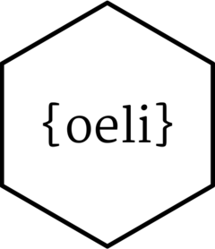

# My Utilities for Developing R Software 

<!-- badges: start -->

<!-- badges: end -->

This R package contains some general utilities that I and maybe others find useful when developing data science software:

- [argument validation](https://loelschlaeger.de/oeli/articles/argument_validation.html)

- user interaction

- timed evaluations

- calculating density values and sampling from densities

- catching exceptions

- working with data common objects such as

  - [data frames](https://loelschlaeger.de/oeli/articles/data_frame_helpers.html)
  
  - [matrices](https://loelschlaeger.de/oeli/articles/matrix_helpers.html)
  
  - [vectors](https://loelschlaeger.de/oeli/articles/vector_helpers.html)

  - dates
  
  - functions and their arguments
  
  - lists  
  
- [storing data](https://loelschlaeger.de/oeli/articles/storage_helpers.html)

- [helpers for building an R package](https://loelschlaeger.de/oeli/articles/package_helpers.html)

