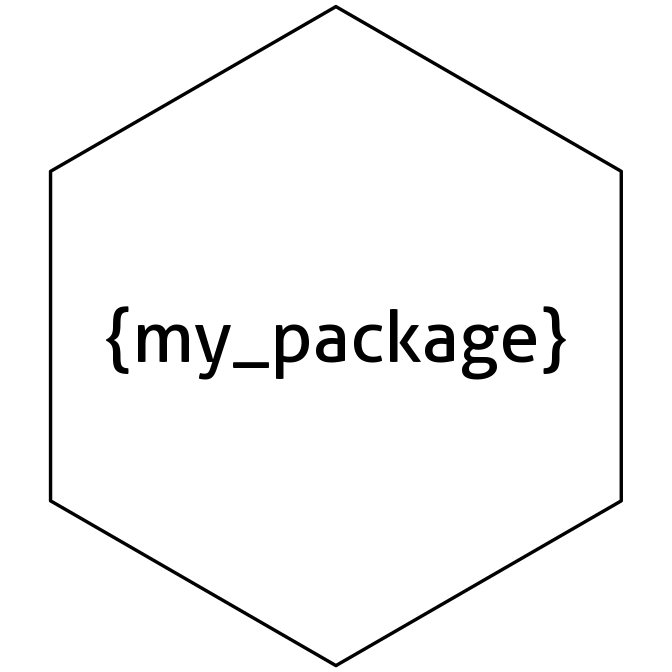

<!-- README.md is generated from README.Rmd. Please edit that file -->

# Utilities for developing R code <a href="https://loelschlaeger.de/oeli/"></a>

<!-- badges: start -->

[](https://CRAN.R-project.org/package=oeli)
[](https://CRAN.R-project.org/package=oeli)
[](https://github.com/loelschlaeger/oeli/actions/workflows/R-CMD-check.yaml)
[](https://app.codecov.io/gh/loelschlaeger/oeli?branch=master)
<!-- badges: end -->

This [R](https://CRAN.R-project.org) package provides helper functions I
found useful when developing R code - perhaps you will too! The released
package version can be installed via:

``` r
install.packages("oeli")
```

The following shows some demos. Click the headings for references on all
available helpers in each category.

### [Distributions](https://loelschlaeger.de/oeli/reference/index.html#distribution)

The package has density and sampling functions for some distributions
not included in base R, like the Dirichlet:

``` r
ddirichlet(x = c(0.2, 0.3, 0.5), concentration = 1:3)
#> [1] 4.5
rdirichlet(concentration = 1:3)
#> [1] 0.3736202 0.2714344 0.3549454
```

For faster computation, [Rcpp](https://www.rcpp.org) implementations are
also available:

``` r
microbenchmark::microbenchmark(
  "R"    = rmvnorm(mean = c(0, 0, 0), Sigma = diag(3)),
  "Rcpp" = rmvnorm_cpp(mean = c(0, 0, 0), Sigma = diag(3))
)
#> Unit: microseconds
#>  expr     min      lq      mean   median       uq      max neval
#>     R 133.594 136.599 154.11343 139.2575 144.7405 1272.113   100
#>  Rcpp   1.690   1.927   2.34702   2.3235   2.5915    7.290   100
```

### [Function helpers](https://loelschlaeger.de/oeli/reference/index.html#functional)

Retrieving default arguments of a `function`:

``` r
f <- function(a, b = 1, c = "", ...) { }
function_defaults(f)
#> $b
#> [1] 1
#> 
#> $c
#> [1] ""
```

### [Indexing helpers](https://loelschlaeger.de/oeli/reference/index.html#indexing)

Create all possible permutations of vector elements:

``` r
permutations(LETTERS[1:3])
#> [[1]]
#> [1] "A" "B" "C"
#> 
#> [[2]]
#> [1] "A" "C" "B"
#> 
#> [[3]]
#> [1] "B" "A" "C"
#> 
#> [[4]]
#> [1] "B" "C" "A"
#> 
#> [[5]]
#> [1] "C" "A" "B"
#> 
#> [[6]]
#> [1] "C" "B" "A"
```

### [Package helpers](https://loelschlaeger.de/oeli/reference/index.html#packaging)

Quickly have a basic logo for your new package:

``` r
logo <- package_logo("my_package", brackets = TRUE)
print(logo)
```



How to print a `matrix` without filling up the entire console?

``` r
x <- matrix(rnorm(10000), ncol = 100, nrow = 100)
print_matrix(x, rowdots = 4, coldots = 4, digits = 2, label = "what a big matrix")
#> what a big matrix : 100 x 100 matrix of doubles 
#>         [,1]  [,2]  [,3] ... [,100]
#> [1,]   -0.68 -1.99 -0.89 ...   0.65
#> [2,]    1.27  0.28 -1.35 ...   0.79
#> [3,]   -1.27 -1.87  0.57 ...  -0.52
#> ...      ...   ...   ... ...    ...
#> [100,]  2.02  0.27  -0.7 ...  -1.59
```

And what about a `data.frame`?

``` r
x <- data.frame(x = rnorm(1000), y = LETTERS[1:10])
print_data.frame(x, rows = 7, digits = 0)
#>      x  y
#> 1    -1 A
#> 2    -1 B
#> 3    -1 C
#> 4     1 D
#> <993 rows hidden>
#>          
#> 998  -1 H
#> 999   1 I
#> 1000  0 J
```

### [Simulation helpers](https://loelschlaeger.de/oeli/reference/index.html#simulation)

Let’s simulate a Markov chain:

``` r
Gamma <- sample_transition_probability_matrix(dim = 3)
simulate_markov_chain(Gamma = Gamma, T = 20)
#>  [1] 2 3 3 3 3 3 3 3 1 2 2 2 2 2 2 2 2 2 3 2
```

### [Transformation helpers](https://loelschlaeger.de/oeli/reference/index.html#transformation)

The `group_data.frame()` function groups a given `data.frame` based on
the values in a specified column:

``` r
df <- data.frame("label" = c("A", "B"), "number" = 1:10)
group_data.frame(df = df, by = "label")
#> $A
#>   label number
#> 1     A      1
#> 3     A      3
#> 5     A      5
#> 7     A      7
#> 9     A      9
#> 
#> $B
#>    label number
#> 2      B      2
#> 4      B      4
#> 6      B      6
#> 8      B      8
#> 10     B     10
```

### [Validation helpers](https://loelschlaeger.de/oeli/reference/index.html#validation)

Is my matrix a proper transition probability matrix?

``` r
matrix <- diag(4)
matrix[1, 2] <- 1
check_transition_probability_matrix(matrix)
#> [1] "Must have row sums equal to 1"
```
