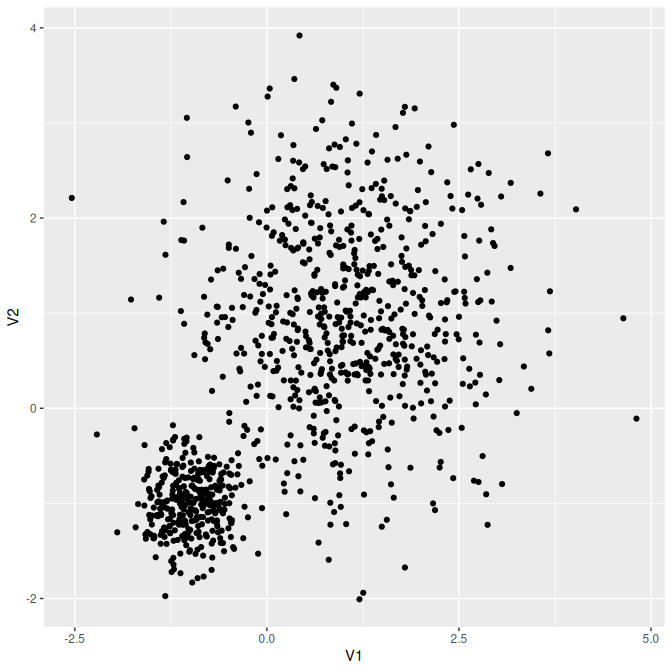
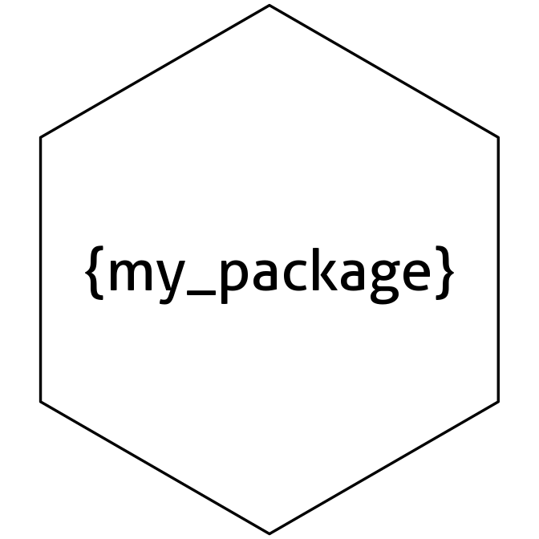

<!-- README.md is generated from README.Rmd. Please edit that file -->

# Utilities for developing R code <a href="https://loelschlaeger.de/oeli/"></a>

<!-- badges: start -->

[](https://CRAN.R-project.org/package=oeli)
[](https://CRAN.R-project.org/package=oeli)
[](https://github.com/loelschlaeger/oeli/actions/workflows/R-CMD-check.yaml)
[](https://app.codecov.io/gh/loelschlaeger/oeli)
<!-- badges: end -->

This [R](https://CRAN.R-project.org) package provides helper functions I
found useful when developing R code - perhaps you will too! The released
package version can be installed via:

``` r
install.packages("oeli")
```

The following shows some demos. Click the headings for references on all
available helpers in each category.

### [Data](https://loelschlaeger.de/oeli/reference/index.html#data)

The `hermann` data contains historical information on editions of the
[Hermannslauf](https://de.wikipedia.org/wiki/Hermannslauf), including
the date, temperature, and winning times for men and women:

``` r
hermann
#> # A tibble: 54 × 8
#> Loading required namespace: lubridate
#>    edition  year date        temp winner_men  time_men   winner_women time_women
#>      <dbl> <dbl> <date>     <dbl> <chr>       <Period>   <chr>        <Period>  
#>  1       1  1972 1972-04-16    NA Helmut Bode 1H 51M 26S Lydia Günne… 3H 22M 0S 
#>  2       2  1973 1973-04-29    14 Helmut Bode 1H 53M 15S Irmhild Hol… 3H 2M 5S  
#>  3       3  1974 1974-04-28    14 Achim Stob… 1H 55M 42S Liane Winter 2H 17M 0S 
#>  4       4  1975 1975-04-27    11 Klaus-Diet… 1H 52M 0S  Christine R… 2H 32M 4S 
#>  5       5  1976 1976-04-25    11 Heribert B… 1H 47M 33S Liane Winter 2H 6M 41S 
#>  6       6  1977 1977-04-24     9 Jim Hodey   1H 48M 23S Liane Winter 2H 6M 22S 
#>  7       7  1978 1978-04-30    16 Michael He… 1H 54M 16S Liane Winter 2H 7M 5S  
#>  8       8  1979 1979-04-29     7 Billy Cain  1H 49M 47S Liane Winter 2H 8M 17S 
#>  9       9  1980 1980-04-27     9 Dieter Lip… 1H 51M 46S Liane Winter 2H 7M 28S 
#> 10      10  1981 1981-04-26    16 Helmut Sch… 1H 52M 15S Rotraud Zin… 2H 21M 16S
#> # ℹ 44 more rows
```

### [Distributions](https://loelschlaeger.de/oeli/reference/index.html#distribution)

The package has density and sampling functions for some distributions
not included in base R, like the Dirichlet:

``` r
ddirichlet(x = c(0.2, 0.3, 0.5), concentration = 1:3)
#> [1] 4.5
rdirichlet(concentration = 1:3)
#> [1] 0.01795087 0.41315984 0.56888929
```

Or the mixture of Gaussian distributions:

``` r
x <- c(0, 0)
mean <- matrix(c(1, 1, -1, -1), ncol = 2) # means in columns
Sigma <- matrix(c(diag(2), 0.1 * diag(2)), ncol = 2) # vectorized covariances in columns
proportions <- c(0.7, 0.3)
dmixnorm(x = x, mean = mean, Sigma = Sigma, proportions = proportions)
#> [1] 0.04100656
pmixnorm(x = x, mean = mean, Sigma = Sigma, proportions = proportions)
#> [1] 0.3171506
rmixnorm(n = 1000, mean = mean, Sigma = Sigma, proportions = proportions) |>
  as.data.frame() |> 
  ggplot2::ggplot() + ggplot2::geom_point(ggplot2::aes(x = V1, y = V2))
```



### [Function helpers](https://loelschlaeger.de/oeli/reference/index.html#functional)

Retrieving default arguments of a `function`:

``` r
f <- function(a, b = 1, c = "", ...) { }
function_defaults(f)
#> $b
#> [1] 1
#> 
#> $c
#> [1] ""
```

### [Indexing helpers](https://loelschlaeger.de/oeli/reference/index.html#indexing)

Create all possible permutations of vector elements:

``` r
permutations(LETTERS[1:3])
#> [[1]]
#> [1] "A" "B" "C"
#> 
#> [[2]]
#> [1] "A" "C" "B"
#> 
#> [[3]]
#> [1] "B" "A" "C"
#> 
#> [[4]]
#> [1] "B" "C" "A"
#> 
#> [[5]]
#> [1] "C" "A" "B"
#> 
#> [[6]]
#> [1] "C" "B" "A"
```

### [Package helpers](https://loelschlaeger.de/oeli/reference/index.html#packaging)

Quickly have a basic logo for your new package:

``` r
logo <- package_logo("my_package", brackets = TRUE)
print(logo)
```



How to print a `matrix` without filling up the entire console?

``` r
x <- matrix(rnorm(10000), ncol = 100, nrow = 100)
print_matrix(x, rowdots = 4, coldots = 4, digits = 2, label = "what a big matrix")
#> what a big matrix : 100 x 100 matrix of doubles 
#>         [,1]  [,2] [,3] ... [,100]
#> [1,]    -0.3 -0.74 -0.1 ...   1.01
#> [2,]    1.39 -2.06 1.29 ...   -0.5
#> [3,]   -0.45 -1.57 0.43 ...   1.61
#> ...      ...   ...  ... ...    ...
#> [100,]  1.12  0.77 -1.6 ...  -0.08
```

And what about a `data.frame`?

``` r
x <- data.frame(x = rnorm(1000), y = LETTERS[1:10])
print_data.frame(x, rows = 7, digits = 0)
#>      x  y
#> 1     0 A
#> 2     1 B
#> 3     0 C
#> 4    -1 D
#> <993 rows hidden>
#>          
#> 998   0 H
#> 999   0 I
#> 1000  2 J
```

### [Simulation helpers](https://loelschlaeger.de/oeli/reference/index.html#simulation)

Let’s simulate correlated regressor values from different marginal
distributions:

``` r
labels <- c("P", "C", "N1", "N2", "U")
n <- 100
marginals <- list(
  "P" = list(type = "poisson", lambda = 2),
  "C" = list(type = "categorical", p = c(0.3, 0.2, 0.5)),
  "N1" = list(type = "normal", mean = -1, sd = 2),
  "U" = list(type = "uniform", min = -2, max = -1)
)
correlation <- matrix(
  c(1, -0.3, -0.1, 0, 0.5,
    -0.3, 1, 0.3, -0.5, -0.7,
    -0.1, 0.3, 1, -0.3, -0.3,
    0, -0.5, -0.3, 1, 0.1,
    0.5, -0.7, -0.3, 0.1, 1),
  nrow = 5, ncol = 5
)
data <- correlated_regressors(
  labels = labels, n = n, marginals = marginals, correlation = correlation
)
head(data)
#>   P C         N1            N2         U
#> 1 5 1 -3.3144847  0.0622969529 -1.074193
#> 2 1 2 -2.8085858 -0.6306880612 -1.253218
#> 3 0 2  0.4622740  0.0103025945 -1.485493
#> 4 2 3 -0.6346636 -0.2965156618 -1.536019
#> 5 1 3  1.1983462 -2.5617480668 -1.739988
#> 6 2 3 -0.7981938  0.0007150796 -1.617020
cor(data)
#>              P          C          N1          N2          U
#> P   1.00000000 -0.3306149 -0.09045314  0.01061425  0.5087675
#> C  -0.33061493  1.0000000  0.29490752 -0.55282073 -0.7660546
#> N1 -0.09045314  0.2949075  1.00000000 -0.30000000 -0.2887367
#> N2  0.01061425 -0.5528207 -0.30000000  1.00000000  0.1074298
#> U   0.50876746 -0.7660546 -0.28873665  0.10742984  1.0000000
```

### [Transformation helpers](https://loelschlaeger.de/oeli/reference/index.html#transformation)

The `group_data.frame()` function groups a given `data.frame` based on
the values in a specified column:

``` r
df <- data.frame("label" = c("A", "B"), "number" = 1:10)
group_data.frame(df = df, by = "label")
#> $A
#>   label number
#> 1     A      1
#> 3     A      3
#> 5     A      5
#> 7     A      7
#> 9     A      9
#> 
#> $B
#>    label number
#> 2      B      2
#> 4      B      4
#> 6      B      6
#> 8      B      8
#> 10     B     10
```

### [Validation helpers](https://loelschlaeger.de/oeli/reference/index.html#validation)

Is my matrix a proper transition probability matrix?

``` r
matrix <- diag(4)
matrix[1, 2] <- 1
check_transition_probability_matrix(matrix)
#> [1] "Must have row sums equal to 1"
```
